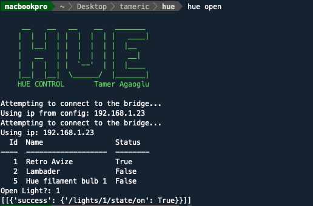
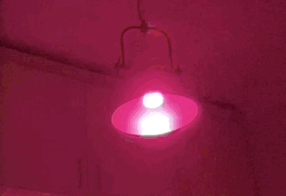

# Hue Cli


#requirements
###python 3
###nmap

```bash
# mac
brew install nmap
### linux
apt-get install nmap
```
###vertualenv

#install
```bash
pip install -r request
```

#run
```bash
python main.py open 
python main.py alarm 
python main.py bri -n 1 -v [0-100] 
python main.py open --no 1 
python main.py close
```

if you want you should added  alias to bash 

Alarm Mode

